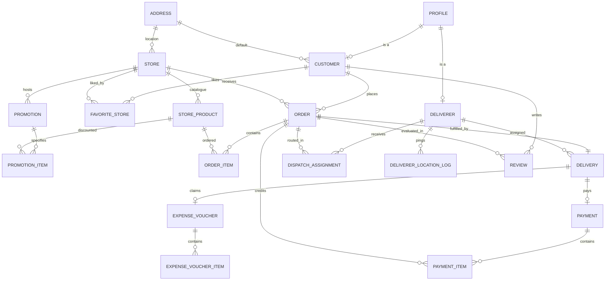

# 🚚 Vanz — Premium Marketplace Logistics & Admin Platform

Welcome to **Vanz**, a state-of-the-art administrative dashboard and high-performance backend API system orchestrating connection, logistics, and transaction workflows between Customers, Merchant Stores, and Deliverers.

```text
 ┌──────────────────────────────────────────────────────────┐
 │                       Vanz System                        │
 │  ┌──────────────┐      ┌──────────────┐      ┌────────┐  │
 │  │  Customers   │ ───> │    Stores    │ ───> │ Orders │  │
 │  └──────────────┘      └──────────────┘      └────────┘  │
 │         │                                         │      │
 │         ▼                                         ▼      │
 │  ┌──────────────┐                             ┌────────┐ │
 │  │   Profiles   │ <────────────────────────── │ Payments│ │
 │  └──────────────┘                             └────────┘ │
 │         ▲                                         ▲      │
 │         │                                         │      │
 │  ┌──────────────┐      ┌──────────────┐       ┌───────┐  │
 │  │  Deliverers  │ ───> │  Deliveries  │ ────> │Expense│  │
 │  └──────────────┘      └──────────────┘       └───────┘  │
 └──────────────────────────────────────────────────────────┘
```

---

## 💎 Core Architecture & Design Philosophy

Vanz is engineered under highly strict full-stack constraints designed to optimize operational efficiency, transaction safety, and clean user experience.

### 1. Front-End Standards
*   **State-Based Router**: Built as a super-responsive Single Page Application (SPA). Conditionally renders panels without the overhead of external router packages.
*   **Unified Client-Side Aggregations & Joins**: To keep backend queries performant and clean, complex data structures (e.g. joining Customer lists with profiles and default addresses) are executed via parallel API fetches combined with ultra-fast client-side Map-lookups.
*   **Rigorous Form Patterns**: 100% of inputs, checkboxes, and selections are validated. Searchable List-of-Values (LoV) modal overlays provide dynamic, filtered item additions.
*   **Aesthetic UI Layer**: Styled using modern typography (DM Sans & DM Mono) paired with a clean dark/slate sidebar navigation, vibrant status badges, and micro-interactions.

### 2. Back-End & DB Standards
*   **Double-Gated Schema Validation**: Payloads for all 15 system resources are strictly parsed at the service layer using strict **Zod schemas** before database commits are made.
*   **Snapshot Pattern**: Addresses, prices, and fees are snapshotted in transactional headers and lines at write time. This protects transaction history from future mutations in master data.
*   **Centralized Error & Winston Logging**: A standardized response envelope provides strict HTTP error categorization. System events and database errors are tracked using structured multi-transport file logging (`logs/combined.log` & `logs/error.log`).

---

## 📊 Database Schema & Relationships

Vanz uses a PostgreSQL database structured into six normalized operational blocks. Primary keys utilize auto-incrementing `int8` serials, and dates utilize standard ISO 8601 timestamps.

### 1. Entity Relationship Overview



### 2. Structured Code Formats
System business keys use predictable, auto-generated formats. Front-end screens leverage client-side predictions before saving:

| Entity | Code Prefix | Example Format | Generation Location |
| :--- | :--- | :--- | :--- |
| **Customer** | `CUST-` | `CUST-0001` | Server-side on `INSERT` |
| **Deliverer** | `DLV-` | `DLV-0001` | Server-side on `INSERT` |
| **Store** | `STR-` | `STR-0001` | Server-side on `INSERT` |
| **Promotion** | `PROMO-` | `PROMO-0001` | Server-side on `INSERT` |
| **Order** | `ORD-YYYY-` | `ORD-2026-000042` | Server-side on `INSERT` (Year-scoped) |
| **Payment** | `PAY-YYYY-` | `PAY-2026-000018` | Server-side on `INSERT` (Year-scoped) |
| **Expense Voucher** | `EXP-YYYY-` | `EXP-2026-000009` | Server-side on `INSERT` (Year-scoped) |

---

## 🔌 API Gateway Summary

The API Gateway is mounted at `/api/v1/`. Every transaction endpoint handles headers and line-items together in a unified body payload.

### Standard Response Envelope
All error responses provide distinct categorization codes and inline field diagnostics for immediate rendering on front-end fields:

```json
{
  "error_code": "VALIDATION_ERROR",
  "message": "Invalid payload format",
  "field_errors": [
    {
      "field": "requestBody.total_price",
      "reason": "must be a non-negative decimal value"
    }
  ]
}
```

### Supported Resource Operations

| Resource Path | GET List | POST Create | PUT Update | DELETE | Key Constraints & Rules |
| :--- | :---: | :---: | :---: | :---: | :--- |
| `/addresses` | ✅ | ✅ | ✅ | ✅ | Blocked if referenced by active Store or Customer |
| `/profiles` | ✅ | ✅ | ✅ | ✅ | Master identity record; cascade-protected |
| `/customers` | ✅ | ✅ | ✅ | ✅ | Updates both profile + address snapshots |
| `/deliverers` | ✅ | ✅ | ✅ | ✅ | Availability enum: `AVAILABLE` / `BUSY` / `OFFLINE` |
| `/stores` | ✅ | ✅ | ✅ | ✅ | Status checks: `ACTIVE` / `INACTIVE` / `SUSPENDED` |
| `/store-products` | ✅ | ✅ | ✅ | ✅ | Automatically filters by active merchant status |
| `/orders` | ✅ | ✅ | ✅ | ✅ | PUT & DELETE allowed only in `PENDING` status |
| `/deliveries` | ✅ | ✅ | ✅ | ✅ | Delivery options: `STANDARD`, `HURRY`, `EXPRESS` |
| `/dispatch-assignments` | ✅ | ✅ | ✅ | ✅ | Allows multiple dispatch retries per order code |
| `/expense-vouchers` | ✅ | ✅ | ✅ | ✅ | Multi-line voucher items. Mutation allowed only in `DRAFT` |
| `/payments` | ✅ | ✅ | ✅ | ✅ | Adjustments component can take negative values |
| `/promotions` | ✅ | ✅ | ✅ | ✅ | Replaces promotion items fully on `PUT` |
| `/favorite-stores` | ✅ | ✅ | ✅ | ✅ | Composite mapping links |
| `/delivery-location-logs` | ✅ | ✅ | ✅ | ✅ | Coordinates track real-time deliverer telemetry |
| `/reviews` | ✅ | ✅ | ✅ | ✅ | Categorized by target type: `STORE` or `DELIVERER` |

---

## 🛠️ Getting Started & Runbook

Follow these quick commands to spin up environments, fix database sequences, and run verification pipelines.

### 1. Initial Setup
Confirm you have Node.js (v18+) installed. Clone the repository and configure environments:

```bash
# Set up backend environments
cd server
cp .env.example .env
# Fill in DATABASE_URL (Supabase URL) and JWT_SECRET

npm install

# Set up frontend environments
cd ../client
npm install
```

### 2. Developer Servers
Launch the parallel development servers for local environment building:

```bash
# In server/ directory
npm run dev

# In client/ directory
npm run dev
```

### 3. Database & System Administration Scripts

Vanz includes pre-configured administration scripts located in the `/server` directory to maintain consistency across the live Supabase instance:

#### ⚡ Fix Database Serials & Sequences
If manual mock data loading disrupts database ID increments, run the sequence corrector utility to align primary key sequences with max row values:
```bash
# In server/ directory
npm run fix-seq
```
*Behind the scenes, this executes [server/fix-sequences.js](file:///c:/Users/KITTIPHAT%20NOIKATE/Documents/GitHub/Vanz/server/fix-sequences.js) which dynamically resets serial sequences across all 15 tables.*

#### 🧪 Run System Correctness Verifications
Execute the full suite of analytical and simple relational join report query tests:
```bash
# In server/ directory
npm run test-reports
```
*This executes [server/test-reports.js](file:///c:/Users/KITTIPHAT%20NOIKATE/Documents/GitHub/Vanz/server/test-reports.js) to assert mathematical correct aggregations across top products, active deliverer ratings, and revenue streams.*
